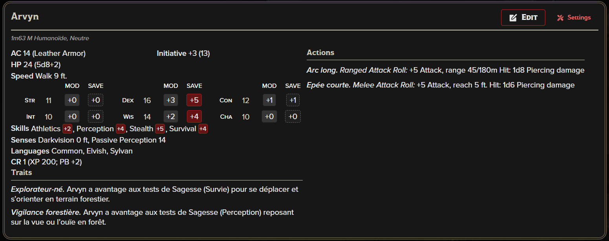

# Arvyn

Appartenance: Galavorn
Fonction: Guetteur des hauteurs
Lieu: Hauts-Feuillus, [[Sylve d'Aerwyn]], Terrasse de Verlae
Race: Demi-Elfe
État: Vivant.e

## 🪪 Identité

- **Nom** : Arvyn
- **Race** : Demi-elfe
- **Alignement** : Neutre
- **Faction / Appartenance** : Sentinelles de Verlae
- **Fonction** : Guetteur des hauteurs
- **Zone de surveillance** : Terrasses de Verlae, Hauts-Feuillus — Sylve d’Aerwyn

🎒 Équipement

- Arc long + carquois (20 flèches)
- Épée courte
- Armure de cuir
- Cape de feuillage
- Cor d’alerte simple (objet narratif)
- Rations, corde, outils de guetteur
    
    
    

## 🎭 Comportement en jeu

- N’engage **jamais seul**
- Donne l’alerte avant tout combat
- Se replie vers les hauteurs
- Soutien à distance uniquement

👉 Arvyn est là pour **repérer, prévenir, ralentir**, pas pour tenir une ligne.

🌲 Rôle dans la Sylve d’Aerwyn

---

Arvyn est l’une des **premières lignes de vigilance** des Hauts-Feuillus. Posté sur les terrasses naturelles de Verlae, il surveille les sentiers en contrebas, les mouvements anormaux dans la canopée et toute présence étrangère à la Sylve.

Il ne prend **aucune décision stratégique seul** : son rôle est d’**observer, identifier et alerter**. Grâce à sa position, il est souvent le **premier à repérer** les intrus, bandits ou créatures errantes avant qu’ils ne s’enfoncent dans la forêt.

---

## 🧠 Caractère & façon d’être

- **Discret** : Arvyn parle peu, parfois pas du tout pendant de longues heures.
- **Patient** : capable de rester immobile pendant des heures, arc en main.
- **Méfiant mais juste** : il ne tire jamais sans raison claire.
- **Observateur** : il mémorise les détails — silhouettes, bruits, habitudes.

Arvyn n’est ni froid ni hostile, mais il n’est pas sociable. Il préfère laisser parler les autres et **répond par des phrases courtes**, souvent factuelles.

> « La forêt parle déjà assez. »
> 

---

## 🧍 Apparence

- Silhouette élancée, typique des demi-elfes sylvestres
- Cheveux sombres, souvent attachés pour ne pas gêner la vue
- Vêtements de cuir et de tissu vert-brun, conçus pour se fondre dans la canopée
- Toujours accompagné de son **arc long**, qu’il ne quitte presque jamais

Son équipement est entretenu avec soin, mais sans ornement : **tout est fonctionnel**.

---

## 🏹 Style de combat (narratif)

- Combat exclusivement à distance
- Privilégie les positions en hauteur
- Tire pour **ralentir ou dissuader**, pas pour massacrer
- Se replie dès que la situation devient dangereuse

Arvyn n’est pas un héros de guerre : il est un **signal d’alarme vivant**.

---

## 🤝 Relations

- **Telor** (frère) : poste de surveillance complémentaire. Arvyn observe, Telor réagit. Leur coordination est instinctive.
- **Sentinelles de Verlae** : respecté pour sa fiabilité, même s’il reste en retrait des échanges sociaux.
- **Étrangers / aventuriers** : observés longtemps avant toute interaction directe.

---

## 🎲 Utilisation en jeu (MJ)

- PNJ d’alerte : annonce un danger avant qu’il n’éclate
- Point de contact discret pour entrer dans les Hauts-Feuillus
- Témoins silencieux d’événements importants
- Peut servir d’indice vivant (« quelqu’un nous observe depuis longtemps »)

---

## 📝 Notes MJ

- Arvyn ne ment pas, mais ne dit jamais tout
- Il fait confiance à ceux qui respectent la forêt
- Toute menace contre Verlae est signalée immédiatement

---

📌 *Fiche prête à être copiée telle quelle dans Notion (sections, titres et citations compatibles).*