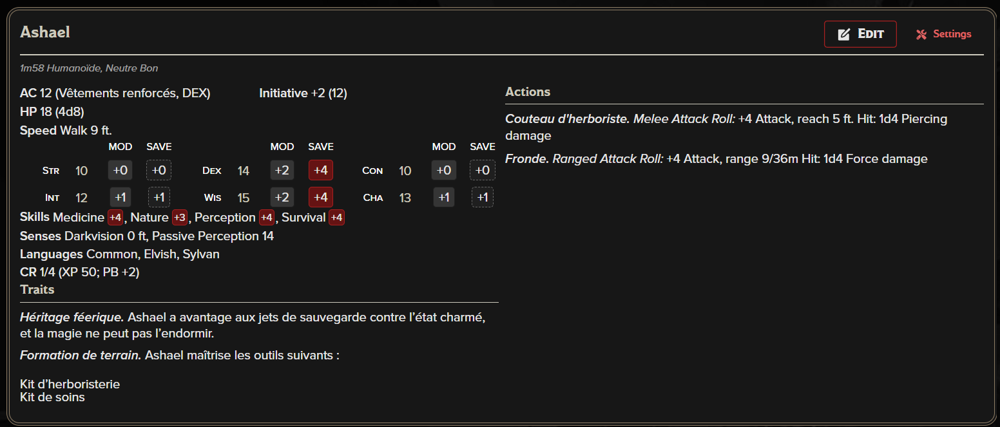

# Ashael

Appartenance: Galavorn, Jardinière du Souffle
Fonction: Apprenti Jardinier
Lieu: Hauts-Feuillus, [[Sylve d'Aerwyn]], Terrasse de Verlae
Race: Demi-Elfe
État: Vivant.e

## 🪪 Identité

- **Nom** : Ashael
- **Race** : Demi-elfe
- **Alignement** : Neutre Bon
- **Appartenance** : Jardinerie du Souffle (Galavorn)
- **Statut** : Apprenti jardinier
- **Lieu de vie** : Terrasses de Verlae, Hauts-Feuillus — Sylve d’Aerwyn

## 🎒 Équipement

- Fronde + 20 pierres
- Couteau d’herboriste
- Sac de collecte (fioles, sachets, étiquettes)
- Kit d’herboristerie
- Kit de soins
- Carnet de notes botaniques
- Vêtements de terrain

---

## 🎭 Comportement en combat

- Panique facilement
- Reste en arrière
- Attaque à distance uniquement
- Fuit dès que la situation devient dangereuse
- Peut utiliser l’action **Aider** pour soutenir un PJ (Médecine / Survie)

👉 Ashael **ne cherche jamais le combat**.

## 🌱 Rôle au sein de la Jardinerie du Souffle

Ashael participe à :

- la **collecte de plantes sensibles et rares**
- l’entretien des paliers végétaux
- l’observation de la croissance et des réactions magiques des espèces
- les expéditions de reconnaissance à courte portée autour des Terrasses

Il n’a pas accès aux rituels majeurs, mais assiste souvent en silence, carnet à la main.

---

## 🧠 Personnalité & façon d’être

- **Enthousiaste** : Ashael s’émerveille de tout
- **Naïf** : il fait facilement confiance
- **Bavard** : parle trop vite, enchaîne les questions
- **Maladroit** : gestes parfois précipités, erreurs sans gravité
- **Courage discret** : face au danger réel, il ne fuit pas toujours

Il veut bien faire, parfois trop. Sa maladresse cache une **volonté sincère de protéger la Sylve**.

> « Si on ne la trouve plus… c’est qu’elle nous manque déjà, non ? »
> 

---

## 🌸 Objectif personnel

Ashael est obsédé par une plante disparue des Terrasses : **la Fleur Spirée**.

Selon les archives galavorn :

- elle aurait disparu lors d’un ancien dérèglement sylvestre
- elle jouerait un rôle clé dans la régénération de certaines essences

Pour Ashael, retrouver la Fleur Spirée serait :

- la preuve qu’il est digne de sa place
- un premier pas vers une reconnaissance réelle

---

## 🤝 Attitude envers les PJ

- **Admiratif** : il idéalise les aventuriers
- **Collant** : pose beaucoup de questions
- **Serviable** : propose son aide sans mesurer le danger
- **Loyal** : s’attache vite

Il peut devenir un **compagnon de voyage temporaire**, surtout lors d’expéditions liées à la flore ou aux Terrasses.

---

## 🎭 Utilisation en jeu (MJ)

- Déclencheur de quête (Fleur Spirée)
- Guide maladroit dans les Hauts-Feuillus
- Témoins innocents d’événements graves
- PNJ émotionnel, attachant, vulnérable

---

## 📝 Notes MJ

- Ashael ne trahira jamais volontairement la Sylve
- Il peut évoluer fortement s’il survit à une aventure marquante
- Sa perte ou sa réussite peut avoir un impact émotionnel fort sur les joueurs